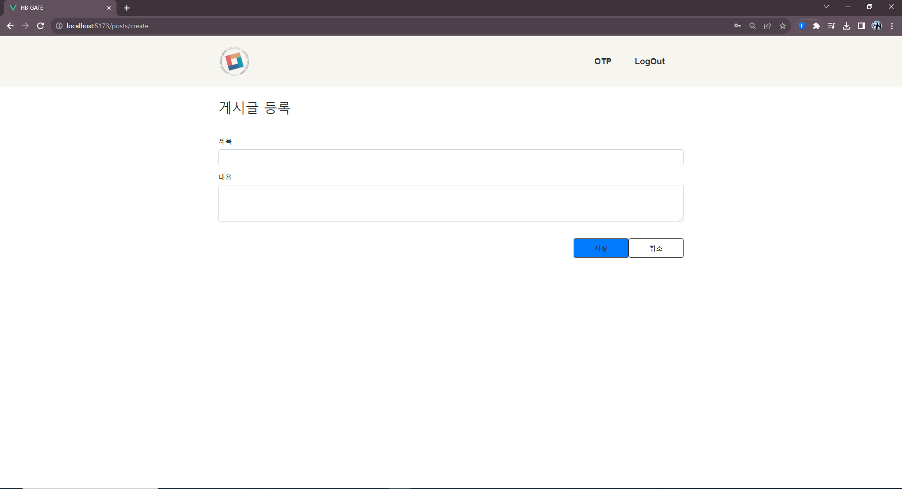

# CapstoneWebProject

## Background

- 공동현관 도어락의 비밀번호는 고정이 되어 있어 무분별한 번호 유출.
- 보안 시스템을 OTP를 활용하여 보안을 강화하기 위한 시스템.
- 회원들을 위한 게시판 및 OTP 발급 웹 개발.

## Stack & Library
- Flask, MariaDB,  Vue.js
- Python, Javascript, HTML, CSS

##  Project Features

### 1. 회원가입 기능

<aside>
- 아이디 비밀번호 설정및 회원의 정보저장
</aside>

### 2. 아이디/비밀번호 찾기 기능

<aside>
- 아이디/비밀번호를 잊어버린 경우 이메일 확인 및 비밀번호 재설정
</aside>

### 3. 게시판 기능

<aside>
- 로그인후 회원들 한에서 게시판 작성, 수정, 삭제 기능
</aside>

### 4. OTP 발급기능

<aside>
서버에 OTP 발급을 요청하여 웹에서 확인 기능
</aside>

## Service UI

## 사용자 서비스

## 1. 메인 홈페이지

## 2. 로그인 페이지

## 3. 아이디/비밀번호찾기 페이지

## 4. 회원가입 페이지

## 5. 게시판 페이지

## 6. OTP 발급 페이지

## I Learned

- 처음으로 vue3.js 프레임워크를 활용하여 웹페이지를 제작해 보았습니다.
- MariaDB를 사용해 스키마를 구성 하고, flask에서 REST API를 구축하였습니다.
- 프로젝트를 진행하면서 웹과 서버간의 요청 및 데이터베이스 구성에 대하여 배웠습니다.